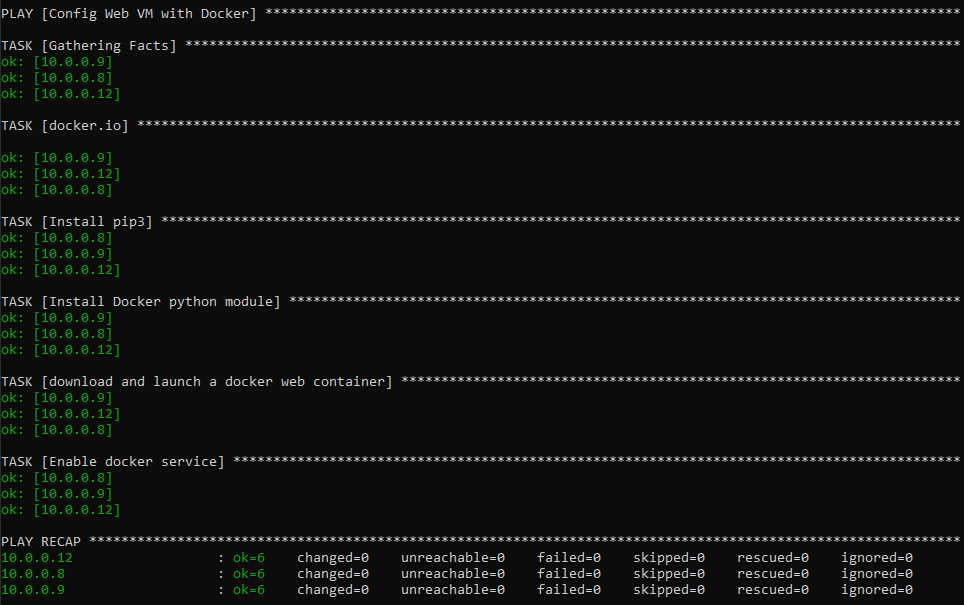
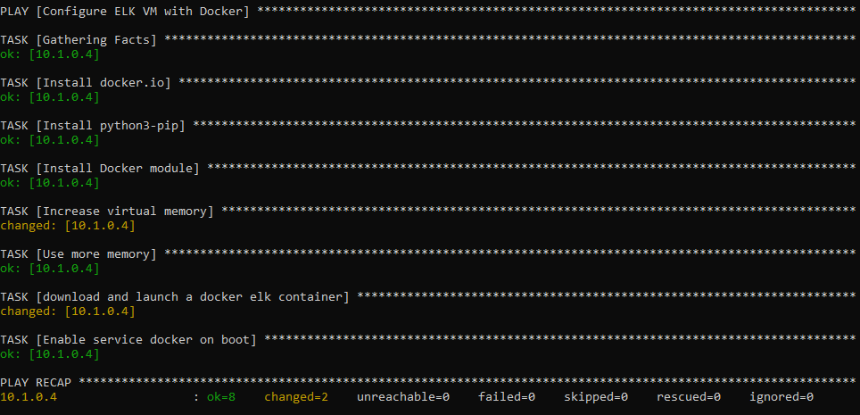

# Ansible playbooks

This directory contains ansible playbooks used to install the docker containers and ELK beats required for the setup of the network.   

These playbooks must be run on the ansible control node, after editing `/etc/ansible/hosts` and `/etc/ansible/ansible.cfg`. 

### Setting up Ansible

- Edit `/etc/ansible/hosts` to include the following lines:
    ```
    [webservers]
    10.0.0.8 ansible_python_interpreter=/usr/bin/python3
    10.0.0.9 ansible_python_interpreter=/usr/bin/python3
    10.0.0.10 ansible_python_interpreter=/usr/bin/python3

    [elk]
    10.1.0.4 ansible_python_interpreter=/usr/bin/python3
    ```
- Edit the following line in `/etc/ansible/ansible.cfg` to include the username configured for the SSH key, if present:   
    `remote_user = azadmin`

### DVWA container

To set up, run: 
`ansible-playbook dvwa-playbook.yml` 

Running the playbook should give an output similar to:   


The playbook is executed on the `webservers` host group and goes through the following steps:
- installs docker.io
- installs python3-pip
- installs docker module for python
- downloads and launches the `cyberxsecurity/dvwa` container
- enables docker service to start on boot

### ELK server 

To set up, run: 
`ansible-playbook elk-playbook.yml`

Running the playbook should give an output similar to:   



The playbook is executed on the `elk` host goes through the following steps:
- installs docker.io
- installs python3-pip
- install docker module for python
- increases available virtual memory
- maps the memory for use
- downloads and launches the `sebp/elk` container
- enables docker service to start on boot

### ELK beats

These playbooks configure the beats by dropping in configuration files from [configs](../configs)   
For information on how to edit the configuration file templates see: [configs/README](../configs/README.md)

#### Multiple beats

To set up, run:
`ansible-playbook beats-playbook.yml`   

_This playbook installs **filebeat, metricbeat, and packetbeat**_ on the `webservers` host group.

Alternatively, you can run each of the following playbooks to install each beat individually:

#### Filebeat

`filebeat-playbook.yml` goes through the following steps:
- downloads filebeat 7.4.0
- installs filebeat 7.4.0 with dpkg
- drops in the configuration file [configs/filebeat-cgf.yml](../configs/filebeat-cfg.yml)   
- enables the filebeat system module
- sets up filebeat
- starts the filebeat service and enables it on boot

#### Metricbeat

`metricbeat-playbook.yml` goes through the following steps:
- downloads metricbeat 7.4.0
- installs metricbeat with dpkg
- drops in the configuration file [configs/metricbeat-cgf.yml](../configs/metricbeat-cfg.yml)   
- enables the metricbeat docker module
- sets up metricbeat
- starts the metricbeat service and enables it on boot

#### Packetbeat

`packetbeat-playbook.yml` goes through the following steps:
- installs libpcap0.8
- downloads packetbeat 7.13.1
- installs packetbeat 7.13.1 with dpkg
- drops in the configuration file [configs/packetbeat-cgf.yml](../configs/packetbeat-cfg.yml)   
- enables the packetbeat docker module
- sets up packetbbeat
- starts the packetbeat service and enables it on boot
