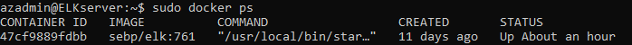

## ELK-Stack Deployment

The files in this repository were used to configure the network depicted below.

These files have been tested and used to generate a live ELK deployment on Azure. They can be used to either recreate the entire deployment pictured above. Alternatively, select playbooks from the [Ansible/playbooks](Ansible/playbooks) directory may be used to install only certain pieces of it, such as Filebeat.

  - Ansible/playbooks
    - [filebeat-playbook](filebeat-playbook.yml)
    - [metricbeat-playbook](metricbeat-playbook.yml)
    - [packetbeat-playbook](packetbeat-playbook.yml)

This document contains the following details:
- Description of the Topology
- Access Policies
- ELK Configuration
  - Beats in Use
  - Machines Being Monitored
- How to Use the Ansible Build

### Description of the Topology

The main purpose of this network is to expose a load-balanced and monitored instance of DVWA, the D*mn Vulnerable Web Application.

Load balancing ensures that the application will be highly available, in addition to restricting access to the network.
- By implementing a Load Balancer we are protecting the availability of the DVWA, potentially defending it against a DDoS attack.
- The JumpBox VM acts as a gateway, restricting access from the internet to the Web VMs and providing an additional layer of protection via configured SSH keys.

Integrating an ELK server allows users to easily monitor the vulnerable VMs for changes to the filesystem and system configuration.
- Filebeat monitors log files or specified locations and forwards them to ElasticSearch or Logstash for indexing.
- Metricbeat collects metrics from systems and services and sends them to ElasticSearch or Logstash.

The configuration details of each machine may be found below.

| Name      | Function   | IP Address | Operating System |
|-----------|------------|------------|------------------|
| JumpBox   | Gateway    | 10.0.0.7   | Linux            |
| Web-1     | DVWA Host  | 10.0.0.8   | Linux            |
| Web-2     | DVWA Host  | 10.0.0.9   | Linux            |
| Web-3     | DVWA Host  | 10.0.0.10  | Linux            |
| ELKserver | Monitoring | 10.1.0.4   | Linux            |

### Access Policies

The machines on the internal network are not exposed to the public Internet. 

Only the JumpBox machine can accept connections from the Internet. Access to this machine is only allowed from my Public IP.

Machines within the network can only be accessed by the JumpBox.
- 

A summary of the access policies in place can be found in the table below.

| Name         | Publicly Accessible | Allowed IP Addresses    | Allowed Ports  | Allowed Protocols |
|--------------|---------------------|-------------------------|----------------|-------------------|
| JumpBox      | Yes                 | PublicIP                | 22             | TCP               |
| Web-1        | No                  | 10.0.0.7, 13.91.129.109 | 22, 80         | TCP               |
| Web-2        | No                  | 10.0.0.7, 13.91.129.109 | 22, 80         | TCP               |
| Web-3        | No                  | 10.0.0.7, 13.91.129.109 | 22, 80         | TCP               |
| ELKserver    | No                  | 10.0.0.7, PublicIP      | 22, 5601, 9200 | TCP               |
| LoadBalancer | Yes                 | PublicIP                | 80             | TCP               |

### Elk Configuration

Ansible was used to automate configuration of the ELK machine. No configuration was performed manually, which is advantageous because with Ansible it is possible to automate the several steps required to install and configure the different docker containers and beats though a script or *playbook* and run them on multiple machines automatically instead of having to ssh into each machine and run each command manually.  

The elk-playbook implements the following tasks:
- Installs docker.io
- Installs python3-pip
- Installs the python docker module
- Increases the maximum virtual memory available and makes the change persistent
- Downloads and launches docker elk container
- Enables the docker service on boot 

The following screenshot displays the result of running `docker ps` after successfully configuring the ELK instance.

### Target Machines & Beats
This ELK server is configured to monitor the following machines:
- 10.0.0.8
- 10.0.0.9
- 10.0.0.10

We have installed the following Beats on these machines:
- Filebeat
- Metricbeat
- Packetbeat

These Beats allow us to collect the following information from each machine:
- `Filebeat` monitors log files and changes made to the filesystem. On the filebeat dashboard on Kibana you can see information such as:
    - SSH logins 
    - New users and groups 
    - Sudo commands  
    - Syslog events that you can expand on.
    

- `MetricBeat` collects system metrics from the operating system and services running on the server. On the kibana dashboard you can see data such as:
    - CPU and memory usage
    - Running processes
    - Inbound and Outbound network traffic
    - System Load
    

### Using the Playbooks
In order to use the playbook, you will need to have an Ansible control node already configured. Assuming you have such a control node provisioned: 

SSH into the control node and follow the steps below:
- Copy the _____ file to _____.
- Update the _____ file to include...
- Run the playbook, and navigate to ____ to check that the installation worked as expected.

_TODO: Answer the following questions to fill in the blanks:_
- _Which file is the playbook? Where do you copy it?_
- _Which file do you update to make Ansible run the playbook on a specific machine? How do I specify which machine to install the ELK server on versus which to install Filebeat on?_
- _Which URL do you navigate to in order to check that the ELK server is running?

_As a **Bonus**, provide the specific commands the user will need to run to download the playbook, update the files, etc._