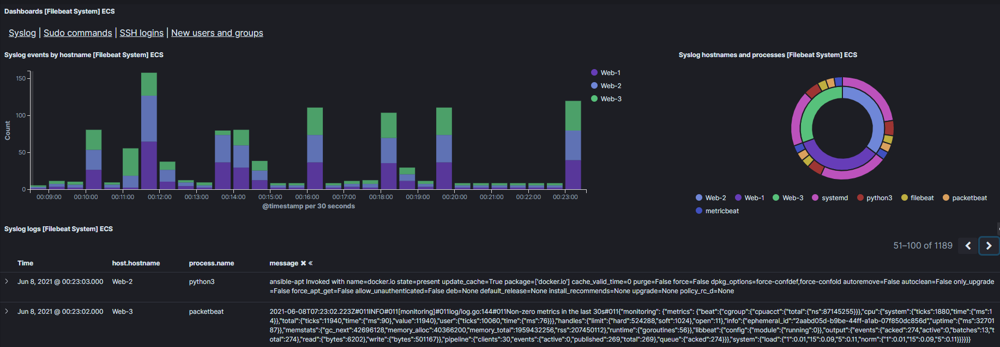

# ELK-Stack Deployment

The files in this repository were used to configure the network depicted below.


These files have been tested and used to generate a live ELK deployment on Azure. They can be used to either recreate the entire deployment pictured above. Alternatively, select playbooks from the `Ansible/playbooks` directory may be used to install only certain pieces of it, such as Filebeat.

  - Ansible/playbooks
    - [dvwa-playbook](Ansible/playbooks/dvwa-playbook.yml)
    - [elk-playbook](Ansible/playbooks/packetbeat-playbook.yml)
    - [beats-playbook](Ansible/playbooks/beats-playbook.yml)
    - [filebeat-playbook](Ansible/playbooks/filebeat-playbook.yml)
    - [metricbeat-playbook](Ansible/playbooks/metricbeat-playbook.yml)
    - [packetbeat-playbook](Ansible/playbooks/packetbeat-playbook.yml)
    
    

This document contains the following details:
- Description of the Topology
- Access Policies
- ELK Configuration
  - Beats in Use
  - Machines Being Monitored
- How to Use the Ansible Build


### Description of the Topology

The main purpose of this network is to expose a load-balanced and monitored instance of DVWA, the D*mn Vulnerable Web Application.

Load balancing ensures that the application will be highly available, in addition to restricting access to the network.
- By implementing a Load Balancer we are protecting the availability of the DVWA, potentially defending it against a DDoS attack.
- The JumpBox VM acts as a gateway, restricting access from the internet to the Web VMs and providing an additional layer of protection via configured SSH keys, ensuring that access is only allowed from one machine as a specific user.

Integrating an ELK server allows users to easily monitor the vulnerable VMs for changes to the filesystem, system metrics, and network traffic.
- Filebeat monitors log files or specified locations and forwards them to ElasticSearch or Logstash for indexing.
- Metricbeat collects metrics from systems and services and sends them to ElasticSearch or Logstash.
- Packetbeat analyzes network packets and traffic flows. 

The configuration details of each machine may be found below.

| Name      | Function   | IP Address | Operating System |
|-----------|------------|------------|------------------|
| JumpBox   | Gateway    | 10.0.0.7   | Linux            |
| Web-1     | DVWA Host  | 10.0.0.8   | Linux            |
| Web-2     | DVWA Host  | 10.0.0.9   | Linux            |
| Web-3     | DVWA Host  | 10.0.0.10  | Linux            |
| ELKserver | ELK Host   | 10.1.0.4   | Linux            |

### Access Policies

The machines on the internal network are not exposed to the public Internet. 

Only the JumpBox machine can accept connections from the Internet. Access to this machine is only allowed from a whitelisted Public IP.

Machines within the network can only be accessed by the JumpBox.
- Network Security Group rules are in place to deny all traffic by default, only allowing necessary services on specific ports.
- The Web VMs are configured to only accept incoming SSH connections from the ansible container on the JumpBox via SSH keys. 

A summary of the access policies in place can be found in the table below.

| Name         | Publicly Accessible | Allowed IP Addresses    | Allowed Ports  | Allowed Protocols |
|--------------|---------------------|-------------------------|----------------|-------------------|
| JumpBox      | Yes                 | PublicIP                | 22             | TCP               |
| Web-1        | No                  | 10.0.0.7, LoadBalancer  | 22, 80         | TCP               |
| Web-2        | No                  | 10.0.0.7, LoadBalancer  | 22, 80         | TCP               |
| Web-3        | No                  | 10.0.0.7, LoadBalancer  | 22, 80         | TCP               |
| ELKserver    | Yes                 | 10.0.0.7, PublicIP      | 22, 5601, 9200 | TCP               |
| LoadBalancer | Yes                 | PublicIP                | 80             | TCP               |

### Elk Configuration

Ansible was used to automate configuration of the ELK machine. No configuration was performed manually, which is advantageous because with Ansible it is possible to automate the several steps required to install and configure the different docker containers and beats though a script or *playbook* and run them on multiple machines automatically instead of having to ssh into each machine and run each command manually.  

To install, configure, and launch the ELK container on the ELKserver:   
`ansible playbook elk-playbook.yml`

For more information about the playbooks see: [playbooks/README](Ansible/playbooks/README.md)   

The elk-playbook implements the following tasks:
- Installs docker.io
- Installs python3-pip
- Installs the python docker module
- Increases the maximum virtual memory available and makes the change persistent
- Downloads and launches docker elk container
- Enables the docker service on boot 

The following screenshot displays the result of running `docker ps` after successfully configuring the ELK instance.


### Target Machines & Beats
This ELK server is configured to monitor the following machines:
- Web-1 (10.0.0.8)
- Web-2 (10.0.0.9)
- Web-3 (10.0.0.10)

We have installed the following Beats on these machines:
- Filebeat
- Metricbeat
- Packetbeat

These Beats allow us to collect the following information from each machine:
- `Filebeat` monitors log files and changes made to the filesystem. On the filebeat dashboard on Kibana you can see information such as:
    - SSH logins 
    - New users and groups 
    - Sudo commands  
    - Syslog events that you can expand on.
    

- `MetricBeat` collects system metrics from the operating system and services running on the server. On the kibana dashboard you can see data such as:
    - CPU and memory usage
    - Running processes
    - Inbound and Outbound network traffic
    - System Load
    

- `Packetbeat` analyzes network packets and traffic flows on configured services or ports. On the Kibana dashboard you can see data such as:
    - DNS and HTTP Transactions
    - Response times and percentiles
    - Erros vs successful transactions
    - Latency
    

## Manual Install

### Setting up Ansible

In order to use the playbooks, you will need to have an Ansible control node already configured. Assuming you have such a control node provisioned:   

- SSH into the ansible container
- Edit `/etc/ansible/hosts` to include the following lines:
    ```
    [webservers]
    10.0.0.8 ansible_python_interpreter=/usr/bin/python3
    10.0.0.9 ansible_python_interpreter=/usr/bin/python3
    10.0.0.10 ansible_python_interpreter=/usr/bin/python3

    [elk]
    10.1.0.4 ansible_python_interpreter=/usr/bin/python3
    ```
- Uncomment and edit the following line in `/etc/ansible/ansible.cfg` to include the username configured for the SSH key, if needed:   
    `# remote_user = root`

### Running the playbooks

All the playbooks referenced below are located in [Ansible/playbooks/](Ansible/playbooks)   
For more information on how to run the playbooks and necessary modifications see: [playbooks/README](Ansible/playbooks/README.md)   
Certain modifications to the configuration files are also required, for more information see: [configs/README](Ansible/configs/README.md)   

1. Clone this repository
    - `git clone https://github.com/giovanni-toledo/ELK-stack.git`
2. Set up Ansible
    - Edit `/etc/ansible/hosts`
    - Edit `/etc/ansible/ansible.cfg`
    - See: `Setting up Ansible` above
3. Navigate to the playbooks directory
    - `cd ELK-stack/Ansible/playbooks`
4. Install the ELK container
    - `ansible-playbook elk-playbook.yml`
5. Install the DVWA
    - `ansible-playbook dvwa-playbook.yml`
6. Modify the configuration files located in [Ansible/configs](Ansible/configs)
    - see [configs/README](Ansible/configs/README.md)
7. Install the beats
    - To install all 3 beats:
        - `ansible-playbook beats-playbook.yml`
    - Alternatively, install each beat individually
        - `ansible-playbook filebeat-playbook.yml`
        - `ansible-playbook metricbeat-playbook.yml`
        - `ansible-playbook packtbeat-playbook.yml`

## Auto-install

Alternatively, it is possible to complete the entire installation with a script.   

`setup.sh`:
- Installs dependencies
- Renders the elasticsearch beats and ansible configuration files with jinja2 using the values in `hosts.py`
- Places every file in its location
- Optionally, also runs the playbooks

For more information about each file: [scripts/README](scripts/README)

1. Clone this repository
    - `git clone https://github.com/giovanni-toledo/ELK-stack.git`
2. Navigate to the autoconfig directory
    - `cd ELK-stack/autoconfig`
3. Edit `hosts.py`
    - The objects in hosts.py already match the description of the network above
    - Modify `hosts` addresses and `remote user` if necessary
4. Run `setup.sh`
    - If you only want to run the setup:
        - `./setup.sh`
            - This renders the configuration files and places everything where it needs to be
            - Then you can run the playbooks individually
    - To run the setup and the playbooks:
        - `./setup.sh install`
            - This runs the setup, then the playbooks